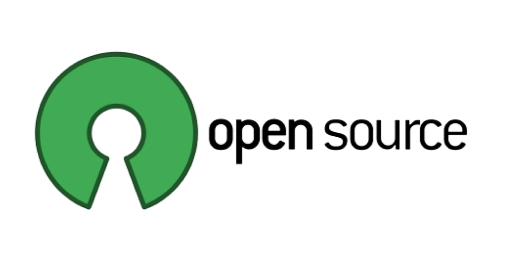

#  Programs and Internships

Apply to these amazing open source programs and internships which provide great exposure and stipends.

| Sr. No.      | Open Source Programs / Internships   | Link   | Description
| :---         |     :---                     | :---:       |  :---
| 1            | Reinforcement Learning Open Source Fest| [Link](https://www.microsoft.com/en-us/research/academic-program/rl-open-source-fest/) | The Reinforcement Learning (RL) Open Source Fest is a global online program focused on introducing students to open source reinforcement learning programs and software development while working alongside researchers, data scientists, and engineers on the Real World Reinforcement Learning team at Microsoft Research NYC. Students will work on a four-month research programming project during their break from university (May-August 2021). Accepted students will receive a $10,000 USD stipend. |
| 2            | LFX Mentorship Program       | [Link](https://mentorship.lfx.linuxfoundation.org/#projects_all)  |  |
| 3            | CNCF Mentoring         | [Link](https://github.com/cncf/mentoring)        | The Cloud Native Computing Foundation (CNCF) participates in a variety of mentoring programs like - LFX Mentorship, GSoC, GSoD, Outreachy, etc. CNCF is a great place to spend a summer learning, coding, participating and contributing. CNCF is an exciting open source foundation with a vibrant community of projects. |
| 4            | MLH Fellowship                            | [Link](https://fellowship.mlh.io)        |  |
| 5            | Google Summer of Code                     | [Link](https://summerofcode.withgoogle.com/about/)        |  |
| 6            | LFN Mentorship Program                    | [Link](https://wiki.lfnetworking.org/display/LN/LFN+Mentorship+Program)        |  |
| 7            | Linux Kernel Mentorship Program           | [Link](https://wiki.linuxfoundation.org/lkmp)        |  |
| 8            | GNOME Internships                         | [Link](https://wiki.gnome.org/Outreach)        |  |
| 9            | Outreachy Internships                     | [Link](https://www.outreachy.org)        |  |
| 10           | Google Season of Docs                     | [Link](https://developers.google.com/season-of-docs/docs/get-started)        |  |
| 11           | X.Org Endless Vacation of Code            | [Link](https://www.x.org/wiki/XorgEVoC/)        |  |
| 12           | Julia Seasons of Contributions (JSoC)     | [Link](https://julialang.org/)        |  |
| 13           | Summer of Haskell                         | [Link](https://summer.haskell.org)        |  |
| 14           | Open Mainframe Project Mentorship Program | [Link](https://www.openmainframeproject.org/projects/mentorship-program)        |  |
| 15           | 24 Pull Requests                          | [Link](https://24pullrequests.com/about)        |  |
| 16           | OSOC                                      | [Link](https://osoc.be)        |  |
| 17           | Hyperledger mentorship program            | [Link](https://wiki.hyperledger.org/display/INTERN/Hyperledger+Mentorship+Program)        |  |
| 18           | Season of KDE 2021                        | [Link](https://season.kde.org)        |  |
| 19           | DataONE Summer Internship Program         | [Link](https://old.dataone.org/internships)        |  |
| 20           | Intern at the FSF                         | [Link](https://www.fsf.org/volunteer/internships)        |  |
| 21           | Processing Foundation Fellowships         | [Link](https://processingfoundation.org/fellowships/)        |  |
| 22           | Hacktoberfest                             | [Link](https://hacktoberfest.digitalocean.com)        |  |
| 23           | FOSSASIA Codeheat                         | [Link](https://codeheat.org)        |  |
| 24           | FOSSASIA Internship Program               | [Link](https://fossasia.org/internship)        |  |
| 25           | DrivenData Competitions                   | [Link](https://www.drivendata.org/competitions/)        |  |
| 26           | Kubernetes Release Team Shadows           | [Link](https://github.com/kubernetes/sig-release/blob/master/release-team/shadows.md)        |  |

